# 1. 使用说明

## 1.1 项目简介

为加深对于操作系统内存管理内容的理解，设计实现一个模拟动态分区分配方式的模拟程序。

## 1.2 项目目的

●实现动态分区分配方式的模拟程序

●设计数据结构、学习分配算法

●加深对动态分区存储管理方式及其实现过程的理解。

## 1.3 项目功能要求

### 1.3.1 基本任务

 动态分区分配方式的模拟

### 1.3.2 功能描述

假设初始态下，可用内存空间为640K，并有下列请求序列，请分别用首次适应算法和最佳适应算法进行内存块的分配和回收，并显示出每次分配和回收后的空闲分区链的情况来。

## 1.4 操作手册

### 1.4.1 选择执行算法

有两种算法可选：首次适应算法与最佳适应算法，点击程序上方menu bar进行选择，如图操作：选择首次适应算法

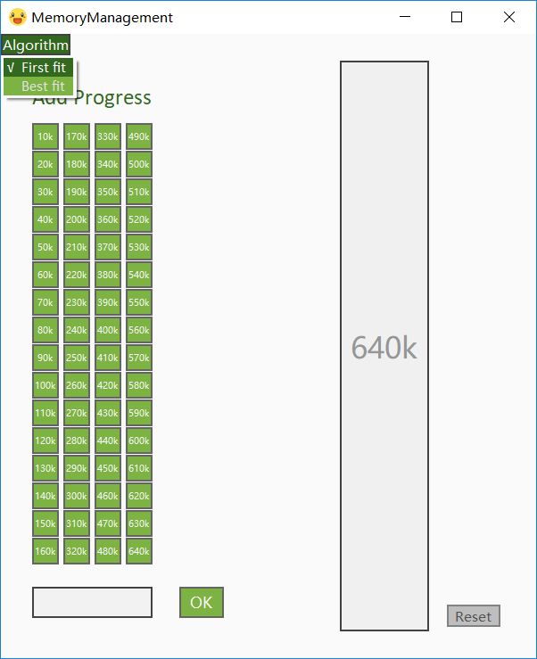

### 1.4.2 作业申请内存空间

①点击快捷申请按钮

一共设有64个快捷申请按钮，每个按钮申请大小间隔为10k，如图操作：作业1申请130k


②输入框进行任意大小申请：

在输入框中输入需要申请的大小（支持三位浮点数与整数），点击OK按钮，如图操作：作业2申请60k

输入60k：

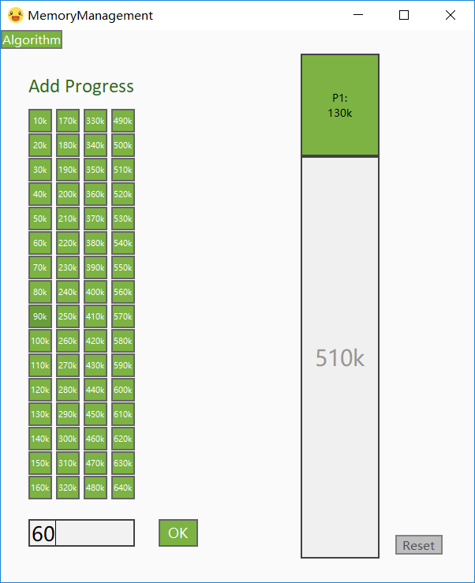

点击OK

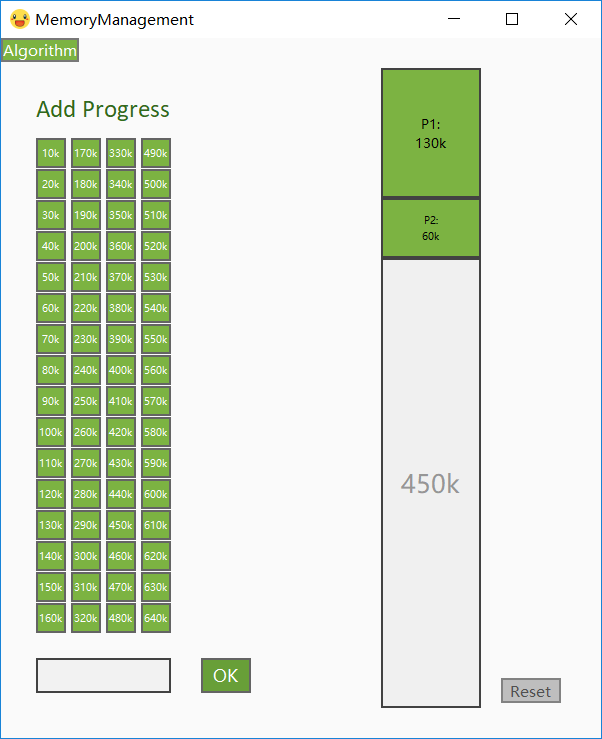

### 1.4.3 释放内存空间：

点击作业块，进行释放，如图操作：作业2释放60k

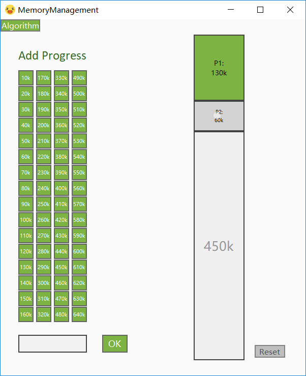


### 1.4.4 重置

点击Reset按钮，重置系统，如图操作：

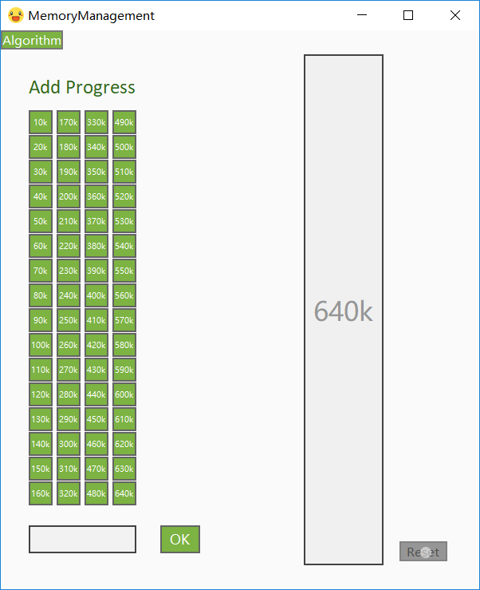


# 2. 程序设计与实现

## 2.1 设计

### 2.1.1开发环境及语言

开发环境：pycharm

开发语言：python

本项目采用PyQt5实现图形化用户界面，达到可视化的目的。

### 2.1.2 算法设计

**首次适应算法（First Fit）：**

该算法从空闲分区链首开始查找，直至找到一个能满足其大小要求的空闲分区为止。然后再按照作业的大小，从该分区中划出一块内存分配给请求者，余下的空闲分区仍留在空闲分区链中。

特点： 该算法倾向于使用内存中低地址部分的空闲区，在高地址部分的空闲区很少被利用，从而保留了高地址部分的大空闲区。显然为以后到达的大作业分配大的内存空间创造了条件。

缺点：低地址部分不断被划分，留下许多难以利用、很小的空闲区，而每次查找又都从低地址部分开始，会增加查找的开销。

**最佳适应算法（Best Fit）：**

该算法总是把既能满足要求，又是最小的空闲分区分配给作业。为了加速查找，该算法要求将所有的空闲区按其大小排序后，以递增顺序形成一个空白链。这样每次找到的第一个满足要求的空闲区，必然是最优的。孤立地看，该算法似乎是最优的，但事实上并不一定。因为每次分配后剩余的空间一定是最小的，在存储器中将留下许多难以利用的小空闲区。同时每次分配后必须重新排序，这也带来了一定的开销。

特点：每次分配给文件的都是最合适该文件大小的分区。

缺点：内存中留下许多难以利用的小的空闲区。

参考：<https://blog.csdn.net/weixin_39282491/article/details/81045441>

### 2.1.3 数据结构设计

采用python的list结构来模拟分区链表

### 2.1.4 类结构设计

①UI类

```python
class Ui_MainWindow(object):
```

​	类成员：

```python
def setupUi(self, MainWindow): # 设置主窗口UI，加载所需的背景，button以及Label
```

②主逻辑窗口类

```python
class myWindow(QtWidgets.QMainWindow):
```

​    类成员：

​		属性：

```python
		self.ui = Ui_MainWindow()  # UI类的实例化
    	self.isbestFit = False  # 标志是否选择bestFit识别API
        self.workNumber = 0  # 作业个数
        self.nodeList = []  # 结点链表
```

​		方法：

```python
   # firstFit从未选状态转变为已选状态时会触发firstFitbar_recognize函数
    def firstFitbar_recognize(self):
    # bestFit从未选状态转变为已选状态时会触发bestFitbar_recognize函数
    def bestFitbar_recognize(self): 
    # 重置内存空间函数
    def clear(self):
    # 寻找首次适应算法添加结点的位置
    def findFirstNode(self, length):   
    # 寻找最佳适应算法添加结点的位置
    def findBestNode(self, length):
    # 添加结点
    def addNode(self, length):
    # 删除作业结点
    def deleteNode(self, workNumber):
    # 加入作业
    def addButton(self, node=[]):
    #文本处理函数
    def text_changed(self):
```

## 2.2 算法实现

首次适应算法：

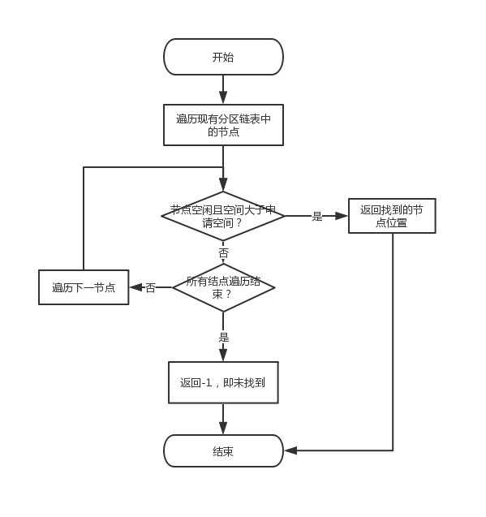

最佳适应算法：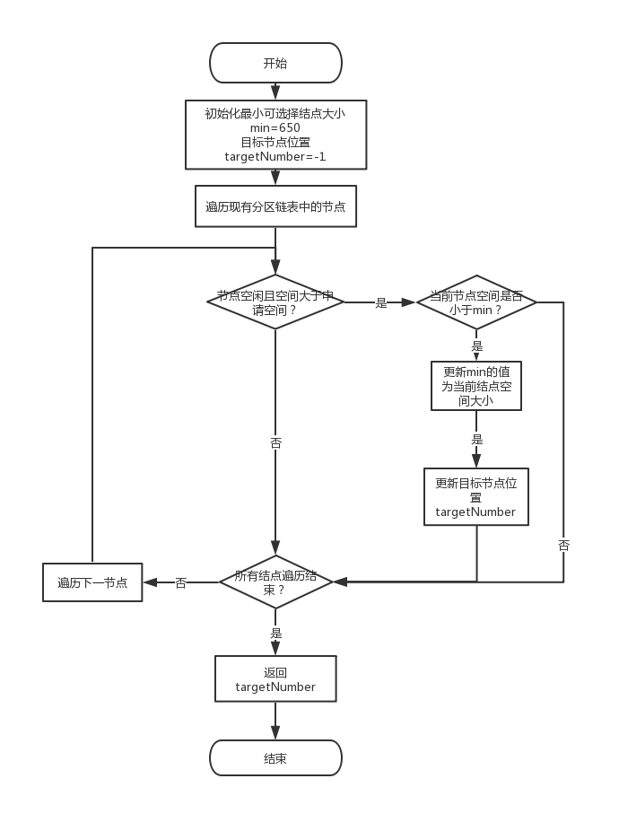

```python
# 寻找首次适应算法添加结点的位置
    def findFirstNode(self, length):
        self.targetNumber = -1
        for i in range(0, len(self.nodeList)):
            # 如果结点i为空闲
            if self.nodeList[i]['isnull'] and self.nodeList[i]['length'] >= length:
                self.targetNumber = i
                return self.targetNumber
        return -1

    # 寻找最佳适应算法添加结点的位置
    def findBestNode(self, length):
        self.min = 650
        self.targetNumber = -1
        for i in range(0, len(self.nodeList)):
            # 如果结点i为空闲
            if self.nodeList[i]['isnull'] and (self.min > self.nodeList[i]['length'] >= length):
                self.min = self.nodeList[i]['length']
                self.targetNumber = i
        return self.targetNumber
```


# 3. 测试

## 3.1 首次适应算法测试


**测试用例：**在下图情况下，申请一块90k的内存

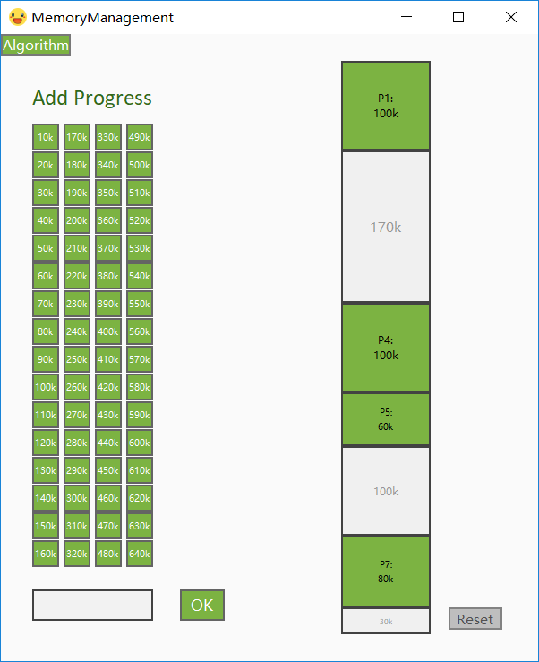

**测试结果：**

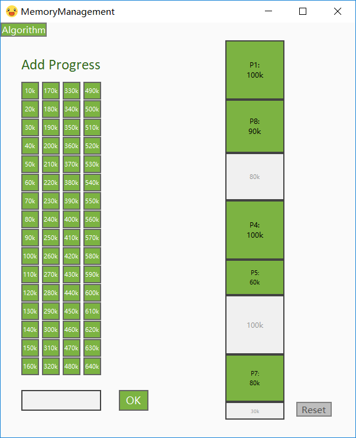

## 3.2 最佳适应算法测试


**测试用例：**在下图情况下，申请一块90k的内存


**测试结果：**

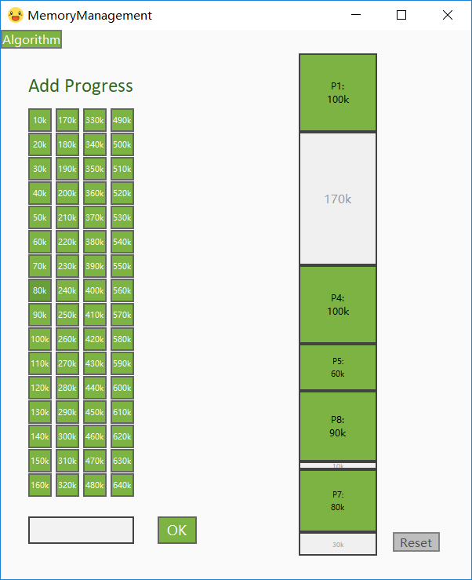

## 3.3 边界测试

当剩余空间小于所要申请的空间，即内存不足时，系统该如何处理。

**测试用例：**

在下图情况下进行测试，申请一块大小为100k的内存

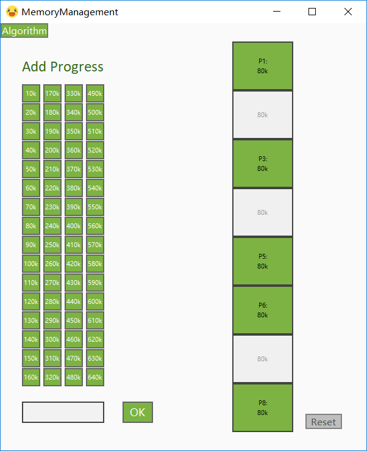

**测试结果：**

系统不会添加，且能正常运行。